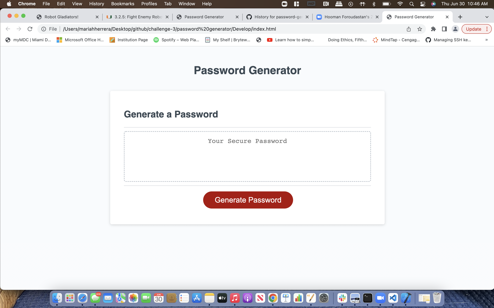

# PASSWORD GENERATOR

## This project is a password generator that compiles random set of letters, numbers and characters for a secure password for the user to use.

## Instructions: First, click on "Generate password" button to get started. Secondly, you will be prompted to enter the amount of Characters you want in your password, be sure to make character length a minimum of 8 characters and a max of 128 characters or the generator will not accept your submission. Thirdly, you will be prompted if you want any numbers, uppercase, lowercase, numbers and symbols. If you do not choose any of these choices then it will give you by default a password with all uppercase lettering. Once you've slected the parameters for your password, the newly generated password should appear in the empty text box above the "Generate password" button.

## The languages used for this project were Html, CSS, and Javascript.

